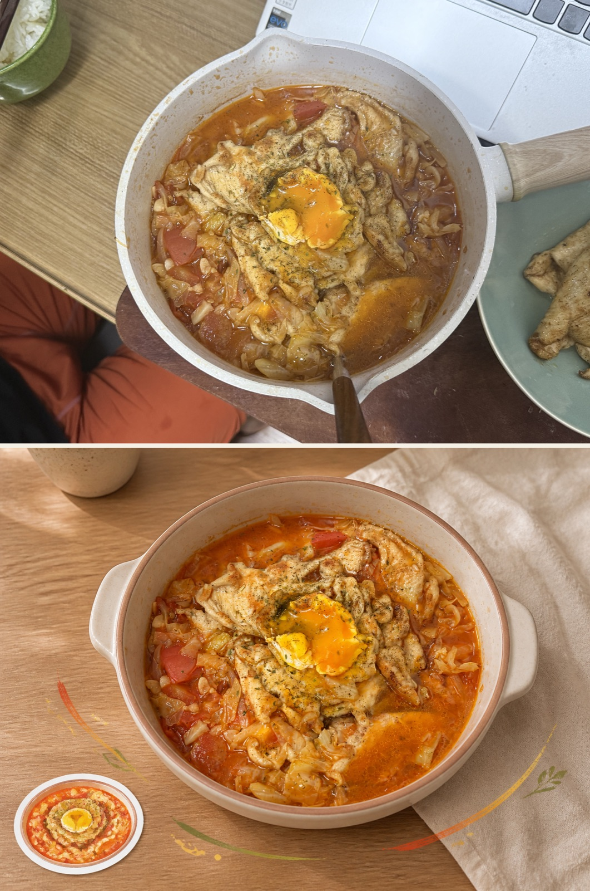
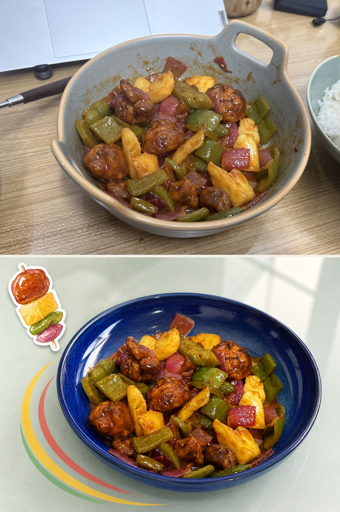
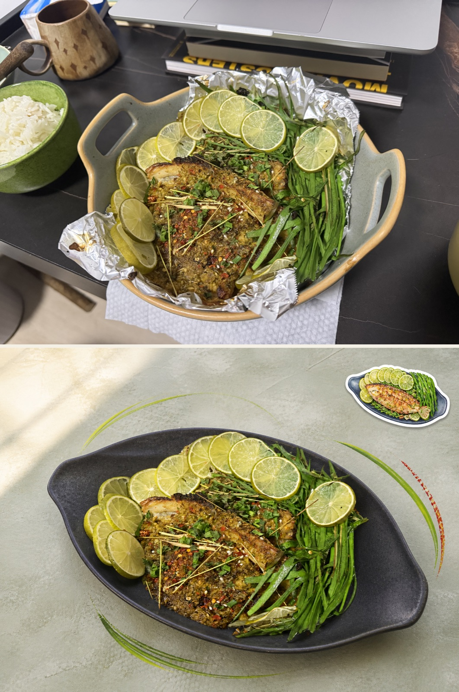
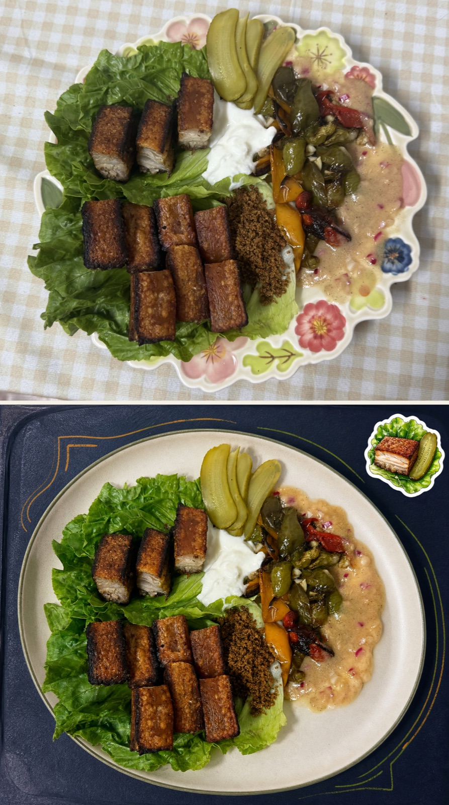
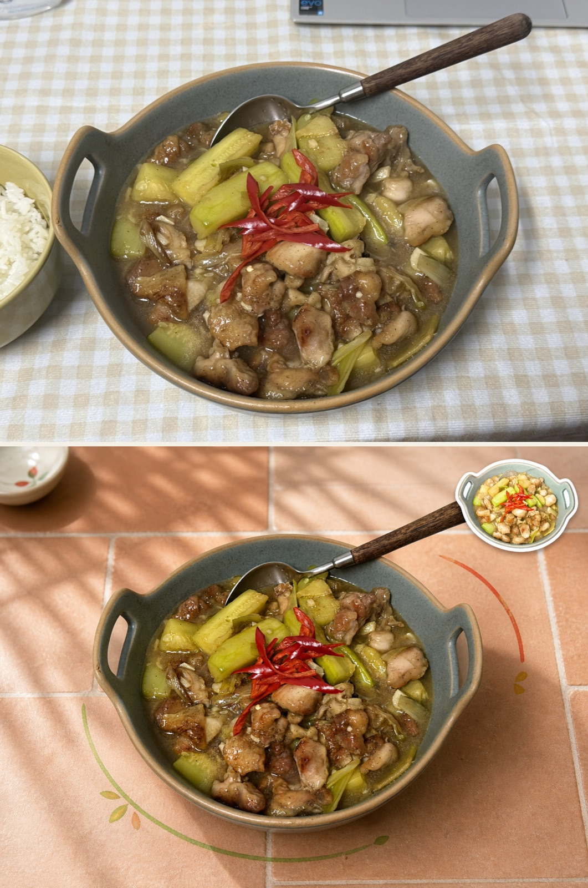
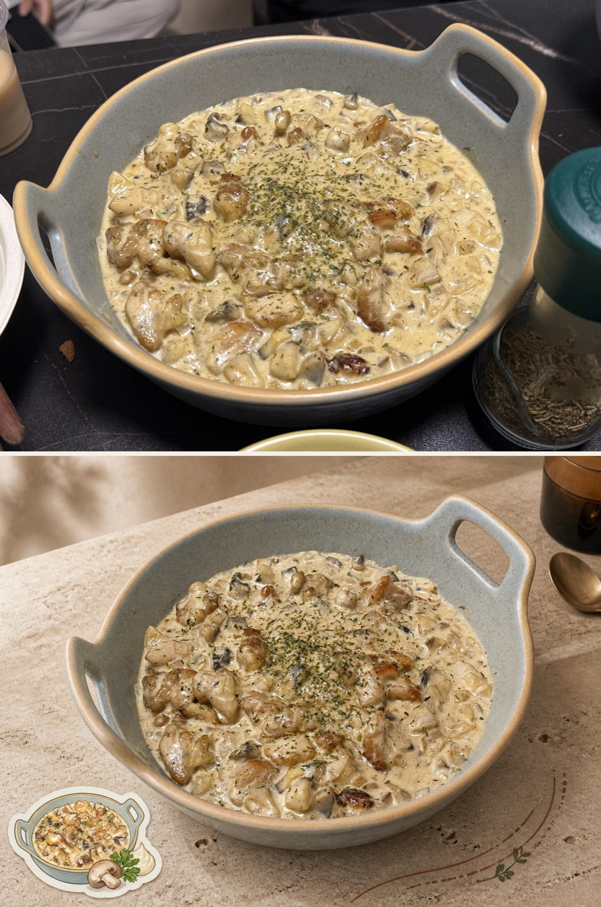

# Food Diary Sticker Editorial 🍳

把随手拍下的家常菜，认真地留成一张值得骄傲的美食日记！

这是一个食物图片编辑 Skill。它会保留真实菜品原本的形状、份量、位置，把不合适的拍摄环境重新整理：清掉桌面杂物，根据菜品选择更协调的餐具、桌面材质、配色与光线，再加上一枚能够概括这道菜特点的水彩或像素贴纸，以及少量从食物中提炼出的环绕线条。

即使拍照时光线一般、桌子有点乱、盘子不太搭，也依然能最大限度保留这顿饭真实的样子，同时让它显得更美味、更有趣、更值得记录！

（也适用于在外拍摄的希望美化背景的美食～支持甜品小吃等其他品类）

希望这个skill可以为你的美食之旅带去更多乐趣！祝你好胃口！Bon appétit 🍳

The repository includes the complete image-editing prompt in both Chinese and English.

## 鸣谢
- 本skill受到@AM.photo-abstract-editorial skill的启发。
- 感谢对象小毅一直做出颇具钻研精神的美味新菜品，你是这个skill诞生的原因，lovelove❤️

## 它会做什么

- **食物纪实**：不擅自增减、移动、规整或重新摆盘，保留家里做出来的真实样子，但是会去掉盘边的杂乱酱汁来保持美观。
- **按菜选场景**：会在石材、釉面砖、漆面、玻璃、金属、细织物、竹席等背景中做食物导向的选择。
- **按需更换餐具**：只有用户允许时才换盘、碗或锅，而且是让新餐具围着原菜生成，不让菜迁就盘子。
- **增加食欲**：统一光向、色温与阴影，轻微提升中间调和色彩，但拒绝 HDR、塑料油光与过度锐化。
- **一枚菜品记忆贴纸**：默认使用干净水彩，也可切换为原创像素画；贴纸会突出这道菜最容易被认出的三到五个特征。
- **可选前后对照图**：适合小红书等平台展示；竖图默认左原图右成图，横图或方图默认上原图下成图，不添加多余标签。

## 示例

以下原图均为本人拍摄。现有横版示例采用“原图在上、处理图在下”；竖版照片会自动改用“左原图、右成图”，让对照图不过度拉长。

| 番茄鸡肉锅 | 菠萝咕咾肉 |
| --- | --- |
|  |  |

| 青柠香草烤鱼 | 脆皮五花肉拼盘 |
| --- | --- |
|  |  |

| 瓠子炖鸡 | 奶油蘑菇鸡 |
| --- | --- |
|  |  |

## 使用方法

下载一个Agent平台软件，codex/claudecode/workbuddy等，本人使用的是codex，不同平台生成效果会不一样。

告诉codex：帮我安装github上的food-diary-sticker-editorial这个skill

也可以直接安装：

```bash
npx skills add https://github.com/ItsZoeFox/food-diary-sticker-editorial
```

开启一个新的 Codex 对话，上传一张食物照片，然后直接说：

```text
使用 food-diary-sticker-editorial 处理这张照片。
```

也可以把意图说得更具体：

```text
使用 food-diary-sticker-editorial 处理这张照片。保留菜本来的样子，去掉电脑和杂物，背景按这道菜来搭配；餐具可以更换。还需要一张上下前后对照图。
```

Skill 会先询问你是否需要前后对照版。默认设置是：

- 只生成一张处理后的独立图片；
- 成图与原图像素尺寸、比例和方向一致；
- 使用一枚干净水彩贴纸；
- 不更换餐具，除非你明确允许；
- 不添加菜名、艺术字、箭头、Logo 或水印。

## 你可以怎么调整

- **餐具**：允许或禁止换盘；也可以指定材质、颜色、形状或地域气质。
- **背景**：选择更居家、更轻盈、更现代、甜品店、餐厅或街头氛围；也可以完全交给 Skill 根据菜品判断。
- **贴纸风格**：默认水彩，可改为原创像素画。
- **贴纸主体与位置**：多道菜时可以指定最想记录的那一道；位置会避开所有主要菜品。
- **装饰强度**：保留少量环绕线条，或者要求完全不加装饰。
- **输出形式**：独立成图、上下对照图，或两者都要。

## 两条原则

1. 真实食物永远是主角。菜品的形态、数量、位置和家常痕迹不能为了“更漂亮”而被改写。
2. 所有新增内容都要服务于这道菜：餐具、背景、灯光、贴纸和线条必须从食物的颜色、质感、结构或用餐语境中推导出来。

## 完整提示词

- 中文版：[references/food-diary-sticker-prompt.zh-CN.md](references/food-diary-sticker-prompt.zh-CN.md)
- English version: [references/food-diary-sticker-prompt.en.md](references/food-diary-sticker-prompt.en.md)

## 内容结构

```text
food-diary-sticker-editorial/
├── README.md
├── SKILL.md
├── agents/
│   └── openai.yaml
├── references/
│   ├── background-routing.md
│   ├── food-diary-sticker-prompt.zh-CN.md
│   └── food-diary-sticker-prompt.en.md
├── scripts/
│   └── compose_food_comparison.py
└── assets/examples/
    └── 6 张前后对照示例图
```

`assets/examples` 只用来说明预期效果。除非用户上传的正是某张示例原图，否则不要把示例中的菜品、餐具、配色或构图复制到新的作品里。

